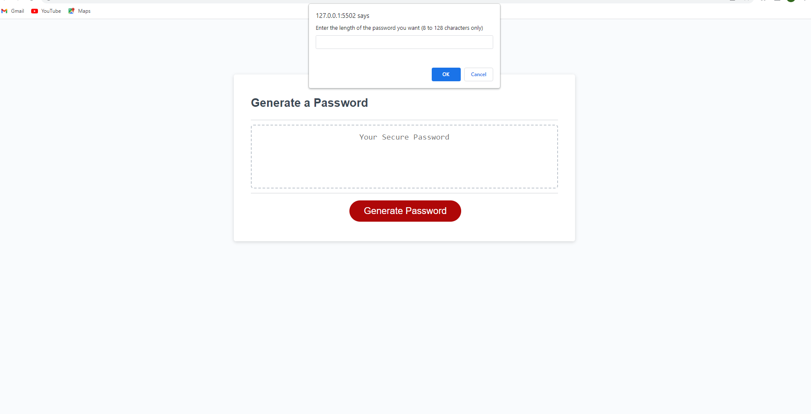
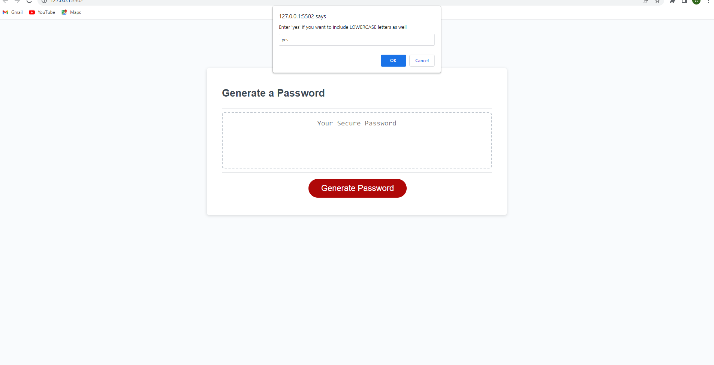
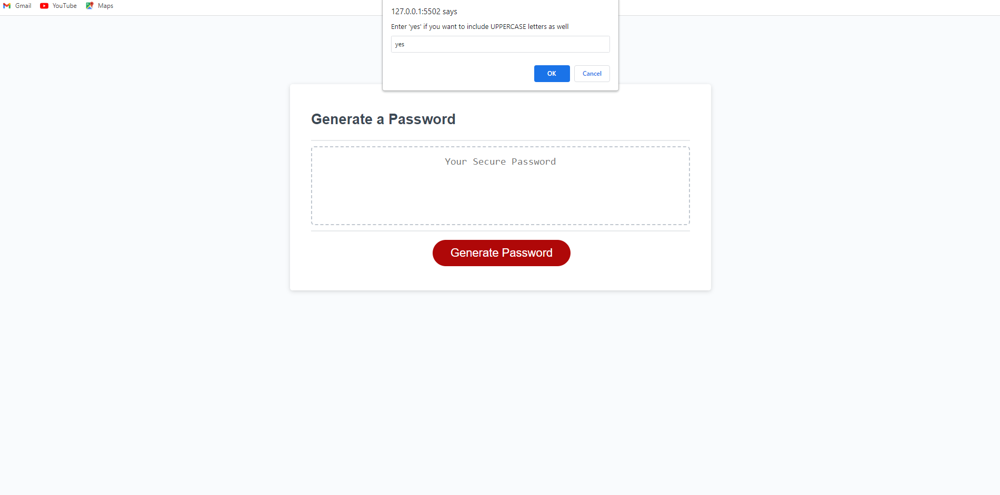

# Strong Password Generator

## Description

A password generator web app is a tool that allows users to create strong, unique, and random passwords for their online accounts. Users can customize the password length and include specific characters, such as numbers, symbols, and uppercase/lowercase letters. The generated passwords are usually designed to be difficult to guess or crack, making them more secure than using simple and easily guessable passwords.

## Table of contents

- [Installation](#installation)
- [Usage](#usage)
- [Screenshot](#screenshot)
- [Contribution](#contribution)
- [Questions](#questions)
- [License](#license)

## Installation

Follow the link of the deployed application [Strong Password Generator](https://aleksandrbausher.github.io/strong-password-generator).

Otherwise clone GitHub repository [Strong Password Generator](https://github.com/AleksandrBausher/strong-password-generator)

## Usage
Click here to access my [Strong Password Generator](https://aleksandrbausher.github.io/strong-password-generator/), 
To know more about me and my projects

## Screenshot

## Contribution

Application was created by Aleksandr Bausher and if you want to contribute send me email.

## Questions

My Email:
[aleksandrbausher@gmail.com](mailto:aleksandrbausher@gmail.com)
My Github:
[AleksandrBausher](https://github.com/aleksandrbausher)

## License

